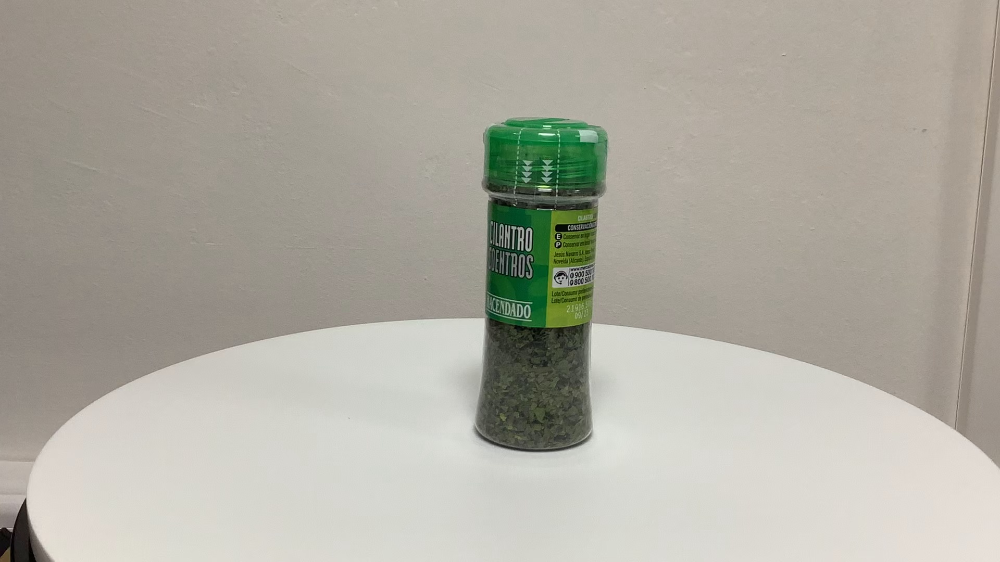
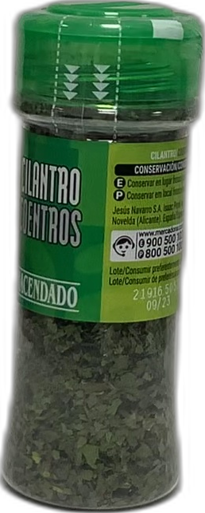

# Synthetic image dataset generator
This repository contains the necesary tools to build an automatic dataset intended to be used on automatic image recognition tasks.

## Get frames from video

First of all, this repository provides the get_frames_from_video.py file. In it you will find the tools needed to take frames from a video where
the items for your image recognition dataset appear.

I have used videos in which the product to be recognized turns around, in order to obtain images of all its angles:

<div align="center">
  <a href="./imgs/example.mov"></a>
</div>

Using method process_videos in get_frames_from_video.py will generate frames taken from the video you use as an argument:


### Usage

```python
import get_frames_from_video
get_frames_from_video.process_videos('PATH_TO_YOUR_VIDEOS', 'file_format')
```

## Remove background from image

Once we have taken frames from the videos we want to use as our dataset, the next step will be to use the method process_image in remove_bg_from_imgs.py.
This method allows us to remove the background from the image and keep only the item that we will use for our image recognition tasks.

To achieve this we have used the rembg tool, that you can find in Github here:

[REMBG tool repository on Github](https://github.com/danielgatis/rembg)

As an advice, the model used by the rembg tool works better the simpler the background of the image is. As you can see in our examples, we have tried to have a plain white background:


<table>
    <thead>
        <tr>
            <td>Original</td>
            <td>After removing the background</td>
        </tr>
    </thead>
    <tbody>
        <tr>
            <td></td>
            <td></td>
        </tr>
    </tbody>
</table>

### Example usage
```python
import remove_bg_from_imgs

remove_bg_from_imgs.rem_bg('YOUR_INPUT_FILE')
```

### Advanced Usage

You can use the method rem_bg from remove_bg_from_imgs just by calling it passing the source image path you want to remove the background from.
Sometimes though, the amount of images you need to remove the background from is enormous and the process may be too long. If this is your case you can use
joblib to easily parallelize the process between the cores of your machine and glob to list all files in a folder like this:

```python
_ = Parallel(n_jobs=-1)(delayed(rem_bg)(input_file) 
                        for input_file in glob.glob("PATH_TO_YOUR_FILES"))
```